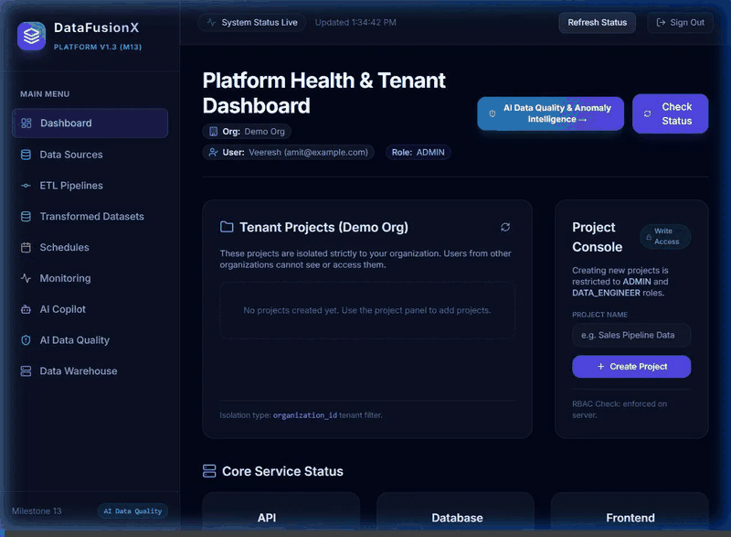
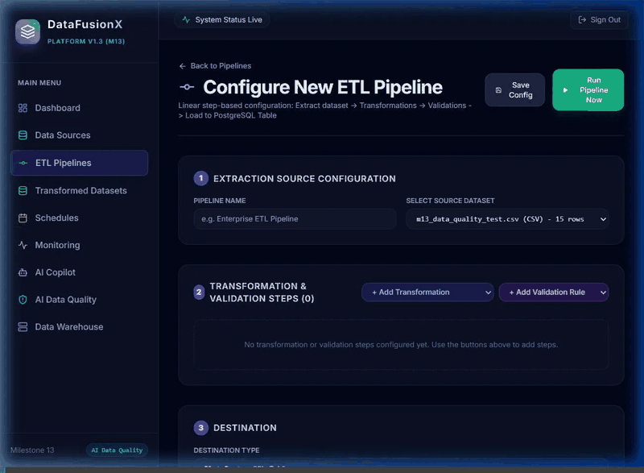
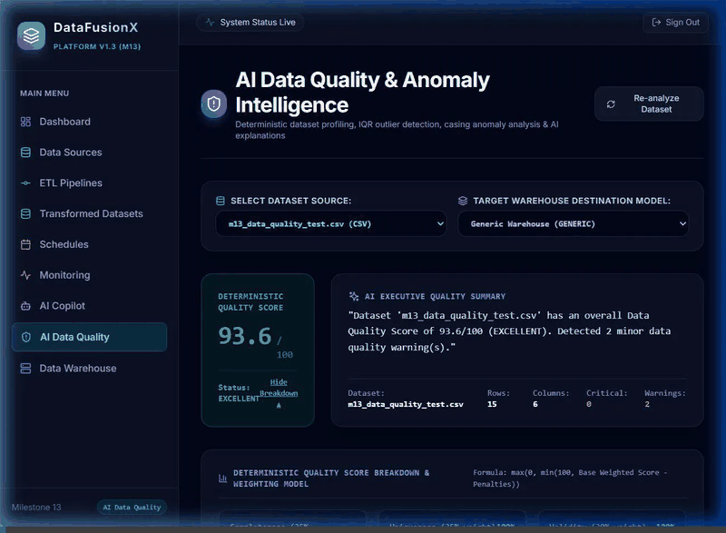
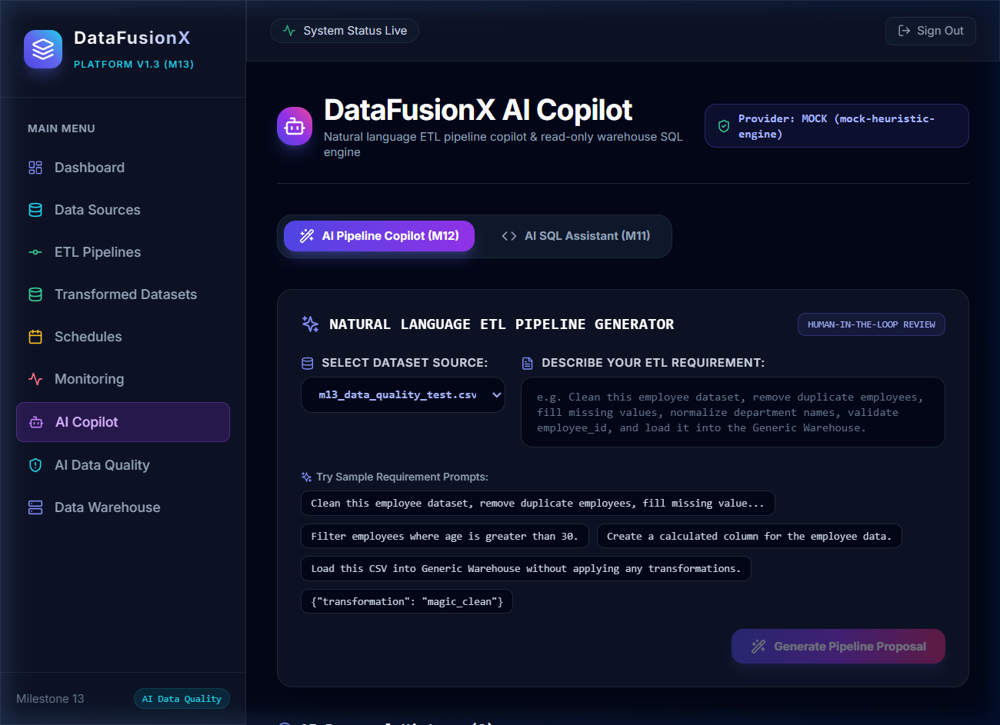

<div align="center">

# ⚡ DataFusionX

### Enterprise-Grade Data Engineering, Pipeline Orchestration & AI Intelligence Platform

[](LICENSE)
[-7928CA?style=for-the-badge)](https://github.com/Veeresh502/DataFusionX)
[](https://www.docker.com/)
[](https://fastapi.tiangolo.com/)
[](https://reactjs.org/)
[](https://www.typescriptlang.org/)
[](https://www.postgresql.org/)
[](https://docs.celeryq.dev/)
[](https://redis.io/)
[](https://prometheus.io/)
[](https://grafana.com/)

<br>

<p align="center">
  <b>A unified, resilient data platform combining visual drag-and-drop workflow orchestration, distributed asynchronous execution, multi-domain star schemas, AST-guarded Text-to-SQL, and deterministic AI Data Quality Intelligence.</b>
</p>

<br>



<br>

[Key Capabilities](#-flagship-capabilities) • [Visual DAG Builder](#1-visual-dag-pipeline-builder) • [AI Data Quality](#2-ai-data-quality--anomaly-intelligence-m13) • [Architecture](#-system-architecture) • [UI & Modules](#-ui--platform-modules) • [Tech Stack](#-technology-stack) • [Quick Start](#-quick-start) • [Service Directory](#-service-directory)

---

</div>

## 📌 Executive Overview

Modern data stacks often suffer from fragmentation—separate tools for pipeline authoring, distributed job scheduling, data profiling, warehouse modeling, and LLM querying. 

**DataFusionX** solves this by unifying the entire data engineering and intelligence lifecycle into a single, cohesive, production-ready platform:

- 🎨 **Visual & Declarative Pipelines**: Build complex DAG workflows with an interactive ReactFlow canvas or declare them programmatically.
- ⚡ **Distributed Asynchronous ETL**: Decoupled Celery worker pools eliminate web timeouts with Redis queuing and real-time WebSocket progress streaming.
- 🏬 **Multi-Domain Star Schemas**: Load clean records into structured Sales Analytics, Manufacturing Analytics, or dynamic custom analytical warehouses.
- 🤖 **AI Pipeline Copilot & Safe Text-to-SQL**: Prompt LLMs in natural language to propose verified DAGs and AST-guarded, read-only SQL queries grounded in active schema metadata.
- 🛡️ **AI Data Quality & Anomaly Intelligence**: Deterministic mathematical score reconciliation, non-parametric IQR outlier detection, high-cardinality key collisions, null spikes, format validation, and AI-enriched remediation insights.
- 📊 **Turnkey Enterprise Observability**: Native Prometheus telemetry metrics and pre-provisioned Grafana monitoring dashboards.

---

## 🏛 System Architecture

```text
┌─────────────────────────────────────────────────────────────────────────────────────────┐
│                                DataFusionX Web Console                                  │
│                 React 18  •  TypeScript  •  Tailwind CSS  •  ReactFlow                  │
└────────────────────────────────────────────┬────────────────────────────────────────────┘
                                             │ HTTP REST / WebSockets (Port 3000 -> 8000)
                                             ▼
┌─────────────────────────────────────────────────────────────────────────────────────────┐
│                                FastAPI Gateway & Core                                   │
│   • Multi-Tenant Auth & RBAC                  • Deterministic Data Profiling Engine     │
│   • Visual DAG Validator & Compiler           • Dynamic Star-Schema Normalization       │
│   • AST-Guarded Safe Text-to-SQL              • Grounded AI Assistant & Copilot         │
└───────────────┬────────────────────────────┬────────────────────────────┬───────────────┘
                │                            │                            │
     SQLAlchemy │                 Celery Bus │ Message Queue              │ Cron Schedule
                ▼                            ▼                            ▼
┌────────────────────────────┐ ┌───────────────────────────┐ ┌────────────────────────────┐
│   PostgreSQL 16 Storage    │ │      Redis 7 Broker       │ │   Celery Beat Scheduler    │
│  • System Metadata & DAGs  │ └─────────────┬─────────────┘ │  • Overlap Protection      │
│  • Star-Schema Warehouses  │               │               │  • Timezone-Aware Cron     │
│  • Audit & Execution Logs  │               ▼               └────────────────────────────┘
└────────────────────────────┘ ┌───────────────────────────┐
                               │       Celery Workers      │
                               │  • Extraction             │ ─────► Prometheus Metrics
                               │  • Transformation         │             (Port 9090)
                               │  • Validations            │                  │
                               │  • Warehouse Loading      │                  ▼
                               └───────────────────────────┘          Grafana Dashboards
                                                                          (Port 3001)
```

---

## 🚀 Flagship Capabilities

### 1. Visual DAG Pipeline Builder

Design, configure, and inspect data extraction and transformation pipelines on an interactive, visual canvas:



- **Interactive ReactFlow Canvas**: Live zooming, smooth panning, auto-layout formatting, and connector snapping.
- **Comprehensive Node Palette**:
  - 📥 **Sources**: CSV, JSON, PostgreSQL tables, REST API endpoints.
  - 🔄 **Transformations**: `Remove Duplicates`, `Fill NULL`, `Drop NULL`, `Trim Text`, `Normalize Text`, `Rename Columns`, `Change Data Types`, `Filter Rows`, `Calculate Column`.
  - 🛡️ **Validations**: `NOT NULL`, `UNIQUE`, `RANGE`, `REGEX` constraints.
  - 🏬 **Destinations**: `Generic Warehouse`, `Sales Analytics Star Schema`, `Manufacturing Analytics Star Schema`.
- **Pre-Execution Topology Compiler**: Detects graph cycles, catches unreferenced upstream columns, and verifies parameter contracts before execution begins.
- **Node Drawer Inspector**: Slide-over configuration drawer allows granular node customization with instant configuration persistence.

---

### 2. AI Data Quality & Anomaly Intelligence (M13)

A deterministic, mathematically grounded profiling engine coupled with AI-enriched remediation insights:



- **Single Source of Truth**: All statistical metrics, null counts, distinct counts, outliers, penalties, and overall quality scores are computed exclusively by the backend profiling engine—zero client-side calculation.
- **Transparent Mathematical Reconciliation**:
  The final quality score reconciles dimension scores with an anomaly deduction penalty:

  $$\text{Base Weighted Score} = (\text{Completeness} \times 0.35) + (\text{Uniqueness} \times 0.35) + (\text{Validity} \times 0.30)$$

  $$\text{Final Quality Score} = \max\Big(0, \min\big(100, \text{Base Weighted Score} - \text{Total Penalties}\big)\Big)$$

- **Standardized Severity Penalty Matrix**:

| Finding Severity | Penalty Deduction | Description |
| :---: | :---: | :--- |
| 🔴 **Critical** | `-10.0 pts` | Severe schema violations, missing primary keys, corrupted required fields |
| 🟡 **Warning** | `-3.0 pts` | Statistical IQR outliers, format anomalies, inconsistent capitalization |
| 🔵 **Informational** | `0.0 pts` | Metadata observations, distribution notes, cardinality statistics |
| 🛡️ **Penalty Cap** | `-50.0 pts max` | Prevents negative score runaway on severely degraded datasets |

- **Deterministic Anomaly Detectors**:
  - 📈 **IQR Outliers**: Non-parametric Interquartile Range ($Q_1, Q_3, \text{IQR}$, statistical fences) with minimum sample-size guardrails ($N \ge 4$).
  - 🔍 **Candidate Key & Row Duplicates**: Identifies primary keys and candidate keys via token boundaries (`id`, `uuid`, `key`, `hash`) and uniqueness heuristics ($>85\%$), detecting both full-row and key collisions.
  - 🚫 **Null & Empty Value Spikes**: Column-level NULL ratios, whitespace-only strings, and empty value checks.
  - 🔤 **Format & Casing Normalization**: Strict regex email formatting and capitalization consistency checks across text series.
- **Executive AI Insights**: LLM layer synthesizes mathematical anomalies into executive-ready narratives and actionable remediation recommendations without altering computed metrics.

---

### 3. AI Pipeline Copilot & Safe Text-to-SQL

Accelerate pipeline creation and analytical exploration with LLM-assisted tools equipped with strict safety guardrails:

<div align="center">
  
</div>

- **Natural Language to DAG Generation**: Describe business logic in plain conversational English; the copilot returns verified DAG topologies and node parameters.
- **Direct Visual Builder Handoff**: Review and modify AI-suggested pipelines directly in the visual builder before approving execution.
- **AST-Guarded Text-to-SQL**: Generates analytics queries grounded in active schema metadata. Every generated SQL statement is validated using an Abstract Syntax Tree (AST) parser to strictly enforce:
  - Read-only operations (`SELECT` queries only; `DROP`, `INSERT`, `UPDATE`, `ALTER` are blocked).
  - Table name allowlisting (prevents access to auth/credential tables).
  - Automatic row limit safety caps (`LIMIT 500`).

---

### 4. Distributed Asynchronous ETL Engine

Scale batch ingestion with fault tolerance and real-time execution visibility:

- **Decoupled Task Execution**: Eliminates HTTP timeouts by delegating heavy data processing to isolated Celery worker processes.
- **Real-Time WebSocket Streaming**: Dispatches live stage transitions (`EXTRACTING` $\rightarrow$ `TRANSFORMING` $\rightarrow$ `VALIDATING` $\rightarrow$ `LOADING` $\rightarrow$ `SUCCESS` / `FAILED`) directly to user dashboards.
- **Fault-Tolerant Retries**: Configurable exponential backoff retries with full records-processed and records-failed auditing.

---

### 5. Multi-Domain Data Warehousing

Organize clean data into structured analytical models:

- **Sales Analytics Model**: Pre-configured star schema containing `fact_sales` surrounded by `dim_customer`, `dim_product`, and `dim_date`.
- **Manufacturing Analytics Model**: Production star schema tracking `fact_production`, `dim_machine`, `dim_plant`, and `dim_operator`.
- **Dynamic Generic Warehouse**: Automatically structures relational tables on-the-fly for arbitrary uploaded schemas.
- **Domain Schema Guard**: Validates incoming datasets against target warehouse dimensions and facts to prevent accidental corruption.

---

### 6. Automated Scheduling & Observability

Enterprise-grade job dispatching and real-time telemetry:

- **Cron Scheduling**: Celery Beat scheduler supporting standard 5-part cron expressions, configurable timezones, and duplicate dispatch prevention.
- **Prometheus Telemetry**: Native `/metrics` exporter capturing pipeline runtimes, throughput, queue depths, and database connection pools.
- **Grafana Dashboards**: Out-of-the-box dashboards provisioned automatically for instant infrastructure and pipeline visibility.

---

## 🖥 UI & Platform Modules

DataFusionX provides a modern, responsive single-page web console:

| Module | Route | Primary Capabilities |
| :--- | :--- | :--- |
| 📊 **Dashboard** | `/dashboard` | System health overview, recent pipeline runs, and warehouse metrics |
| 🔌 **Data Sources** | `/data-sources` | Ingestion catalog for CSV, JSON, PostgreSQL, and REST API sources |
| 🎨 **Visual DAG Builder** | `/pipelines/new` | Drag-and-drop pipeline construction canvas with interactive configuration drawers |
| ⚙️ **Pipelines List** | `/pipelines` | Pipeline inventory, status badges, and execution controls |
| 📈 **Pipeline Executions** | `/executions` | Live execution timeline, stage progress bars, and execution logs |
| ⏱️ **Pipeline Schedules** | `/schedules` | Automated cron job manager with timezone and active toggle controls |
| 🏬 **Warehouse Dashboard** | `/warehouse` | Multi-domain star-schema tables, schema explorer, and row-count metrics |
| 📦 **Transformed Datasets**| `/datasets` | Clean transformed analytical datasets ready for downstream consumption |
| 🤖 **AI Copilot** | `/ai-copilot` | Natural-language-to-DAG generation and AST-guarded Text-to-SQL query assistant |
| 🛡️ **AI Data Quality** | `/data-quality` | Comprehensive data profiling, mathematical scoring, anomaly cards, and AI advice |
| 📉 **Monitoring** | `/monitoring` | Operational telemetry with direct links to Prometheus and Grafana dashboards |

---

## 💻 Technology Stack

| Layer | Technologies |
| :--- | :--- |
| **Frontend UI** | React 18, TypeScript, Vite, Tailwind CSS, ReactFlow, Lucide React, Axios |
| **Backend Core** | Python 3.11, FastAPI, Uvicorn, Pydantic v2, Pandas, NumPy, Scikit-Learn |
| **Database & ORM** | PostgreSQL 16 Alpine, SQLAlchemy 2.0, Alembic Database Migrations |
| **Distributed Engine**| Celery 5.3, Redis 7 Alpine, WebSockets |
| **Observability** | Prometheus v2.51, Grafana 10.4 |
| **Containerization** | Docker, Docker Compose, Nginx (Frontend Reverse Proxy) |

---

## ⚡ Quick Start

Deploy the entire DataFusionX stack in minutes using Docker Compose.

### 1. Clone the Repository
```bash
git clone https://github.com/Veeresh502/DataFusionX.git
cd DataFusionX
```

### 2. Launch All Services
```bash
docker compose up -d --build
```

### 3. Verify Container Health
```bash
docker compose ps
```
All containers will display an `Up` / `healthy` status:
- `datafusionx-frontend`
- `datafusionx-backend`
- `datafusionx-postgres`
- `datafusionx-redis`
- `datafusionx-celery-worker`
- `datafusionx-celery-beat`
- `datafusionx-prometheus`
- `datafusionx-grafana`

### 4. Run Database Migrations
```bash
docker compose exec backend alembic upgrade head
```

You can now open the web application in your browser and register your administrator account.

---

## 🌐 Service Directory

| Service | Port | Access / Credentials | Description |
| :--- | :---: | :--- | :--- |
| **Web Console** | `3000` | Register / Login in UI | Main user interface |
| **REST API Gateway** | `8000` | JWT Bearer Token | Core backend service |
| **Interactive API Docs**| `8000 (/docs)` | Swagger UI | API endpoint testing & schema documentation |
| **Grafana Dashboards** | `3001` | `admin` / `admin` | Real-time system and ETL telemetry |
| **Prometheus Telemetry**| `9090` | Direct Access | Raw metrics scraping & query console |
| **PostgreSQL Database**| `5432` | Stack managed | Relational metadata and data warehouse storage |
| **Redis Broker** | `6379` | Stack managed | Celery task queuing and caching broker |

---

## 🧪 Testing & Quality Assurance

DataFusionX includes a comprehensive automated test suite covering unit functionality, multi-tenant isolation, DAG compilers, transformation rules, and generalized data quality lifecycle validation:

```bash
# Run the complete test suite
docker compose exec backend pytest -v

# Run AI Data Quality & Profiling tests
docker compose exec backend pytest -v app/tests/test_ai_data_quality.py app/tests/test_generalized_data_quality_lifecycle.py

# Run specific profiling engine unit tests
docker compose exec backend pytest -v app/tests/test_profiling.py
```

---

## 📂 Project Structure

```text
DataFusionX/
├── docs/
│   └── assets/                 # Animated GIFs and high-resolution platform previews
├── backend/
│   ├── app/
│   │   ├── api/endpoints/      # REST API endpoints (auth, sources, pipelines, ai, warehouse)
│   │   ├── core/               # Configuration, Celery application, metrics, and security
│   │   ├── db/                 # Database session and base definitions
│   │   ├── models/             # SQLAlchemy ORM models
│   │   ├── schemas/            # Pydantic v2 validation models
│   │   ├── services/           # Profiling engine, DAG compiler, ETL engine, SQL safety
│   │   ├── tasks/              # Celery asynchronous task handlers
│   │   └── tests/              # Automated Pytest test suites
│   ├── alembic/                # Database migration scripts
│   └── Dockerfile              # Python 3.11 container definition
├── frontend/
│   ├── src/
│   │   ├── components/         # Reusable UI components, navigation, DAG drawers
│   │   ├── pages/              # Platform page views (Dashboard, Pipelines, AI Quality, Copilot)
│   │   ├── services/           # Axios REST API integration clients
│   │   └── types/              # TypeScript interfaces and type definitions
│   ├── nginx.conf              # Production Nginx reverse proxy config
│   └── Dockerfile              # Multi-stage production container definition
├── docker/                     # Prometheus and Grafana provisioning configurations
├── docker-compose.yml          # Unified multi-service container orchestrator
└── README.md                   # Platform documentation
```

---

## 📄 License

This project is licensed under the **MIT License** — see the [LICENSE](LICENSE) file for details.
